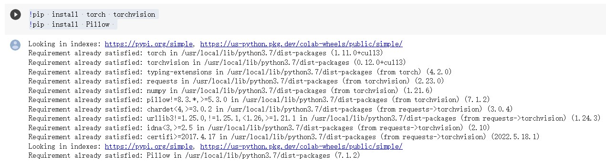
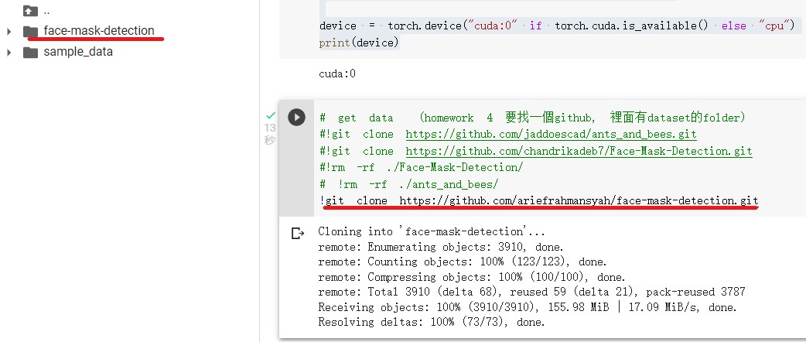

# Topic : Lecture 16 Transfer Learning

Follow the CRSIP-DM method
1. Step 1: Import library, import data
2. Step 2: Pre-processing (missing data, categorical type, normalization, format transform, data augmentation)
3. Step 3: Build ML Model
4. Step 4: Evaluate Model
5. Step 5: Deploy (Prediction)

## Step 1:  Load data (also import library)
!pip install torch torchvision
!pip install Pillow 

# import library
import torch
import numpy as np
import pandas as pd
import matplotlib.pyplot as plt
from torch import nn
import torch.nn.functional as F
from torchvision import datasets, transforms, models

device = torch.device("cuda:0" if torch.cuda.is_available() else "cpu")
print(device)

# get data  (homework 4 要找一個github, 裡面有dataset的folder)
#!git clone https://github.com/jaddoescad/ants_and_bees.git
#!git clone https://github.com/chandrikadeb7/Face-Mask-Detection.git
#!rm -rf ./Face-Mask-Detection/
# !rm -rf ./ants_and_bees/
!git clone https://github.com/ariefrahmansyah/face-mask-detection.git

