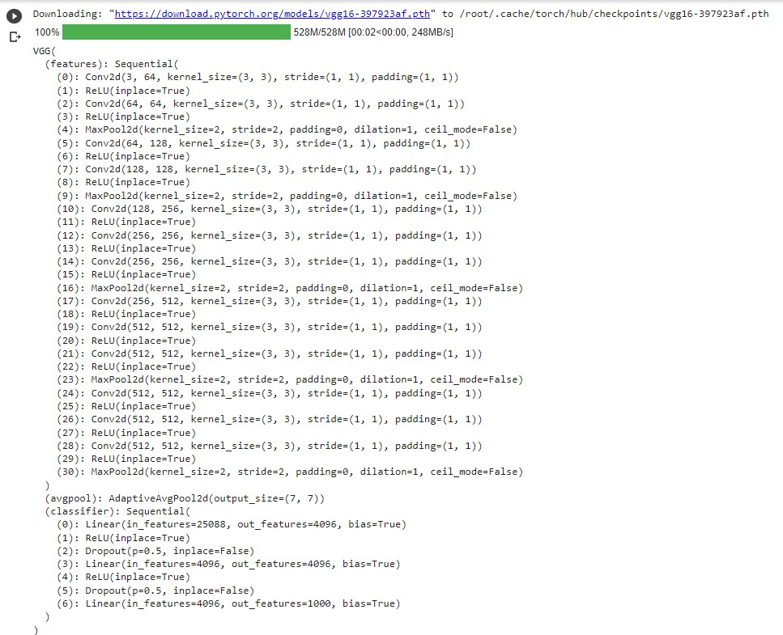
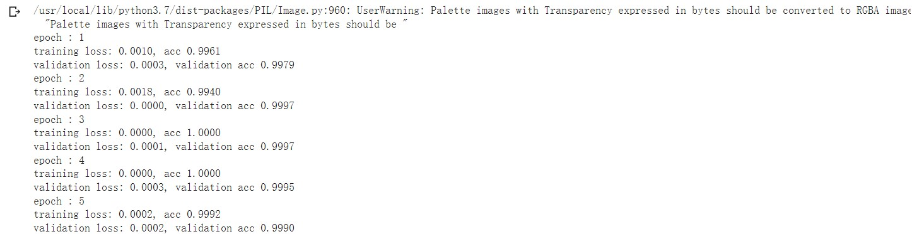
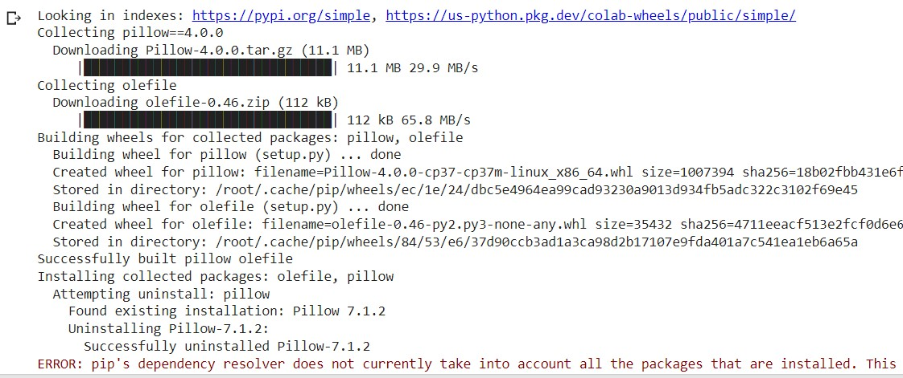
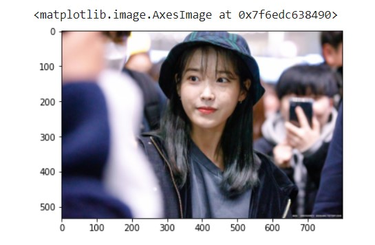
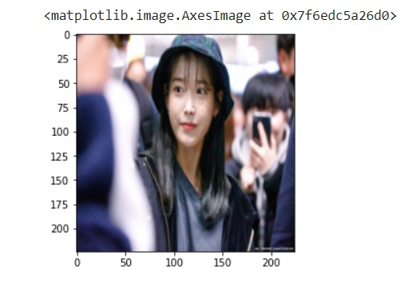
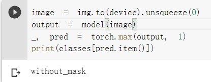
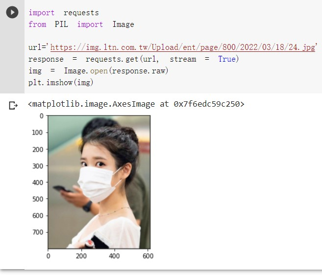
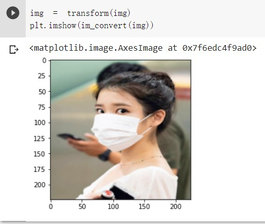
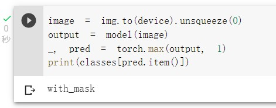

# Topic : Lecture 16 Transfer Learning

Follow the CRSIP-DM method
1. Step 1: Import library, import data
2. Step 2: Pre-processing (missing data, categorical type, normalization, format transform, data augmentation)
3. Step 3: Build ML Model
4. Step 4: Evaluate Model
5. Step 5: Deploy (Prediction)

## Step 1:  Load data (also import library)
!pip install torch torchvision

!pip install Pillow 

# import library
import torch

import numpy as np

import pandas as pd

import matplotlib.pyplot as plt

from torch import nn

import torch.nn.functional as F

from torchvision import datasets, transforms, models

device = torch.device("cuda:0" if torch.cuda.is_available() else "cpu")

print(device)

# get data  (homework 4 要找一個github, 裡面有dataset的folder)

# !git clone https://github.com/jaddoescad/ants_and_bees.git

# !git clone https://github.com/chandrikadeb7/Face-Mask-Detection.git

# !rm -rf ./Face-Mask-Detection/

# !rm -rf ./ants_and_bees/
!git clone https://github.com/ariefrahmansyah/face-mask-detection.git

!ls ./face-mask-detection/data/

# Step 2: Pre-process X, Y
* format transform (轉換成numpy format)
* missing data (imputation)差補
* category data transform 
* data augmentation
* normalization

transform_train = transforms.Compose([

          transforms.Resize((224,224)),

          transforms.RandomHorizontalFlip(),

          transforms.RandomAffine(0, shear=10, scale=(0.8,1.2)),

          transforms.ColorJitter(brightness=1, contrast=1, saturation=1),

          transforms.ToTensor(),

          transforms.Normalize((0.5, 0.5, 0.5), (0.5, 0.5, 0.5))

          ])

transform = transforms.Compose([transforms.Resize((224,224)),

transforms.ToTensor(),

transforms.Normalize((0.5, 0.5, 0.5), (0.5, 0.5, 0.5))

])

training_dataset = datasets.ImageFolder('face-mask-detection/data/', transform=transform)

validation_dataset = datasets.ImageFolder('face-mask-detection/data/', transform=transform)

training_loader = torch.utils.data.DataLoader(training_dataset, batch_size=20, shuffle=True)

validation_loader = torch.utils.data.DataLoader(validation_dataset, batch_size = 20, shuffle=False)

print(len(training_dataset))

print(len(validation_dataset))

def im_convert(tensor):

  image = tensor.cpu().clone().detach().numpy()

  image = image.transpose(1, 2, 0)

  image = image * np.array((0.5, 0.5, 0.5)) + np.array((0.5, 0.5, 0.5))

  image = image.clip(0, 1)

  return image

# !ls ./Face-Mask-Detection/dataset/

classes=('with_mask','without_mask')

dataiter = iter(training_loader)

images,labels = dataiter.next()

fig = plt.figure(figsize=(25, 4))

for idx in np.arange(20):

  ax = fig.add_subplot(2, 10, idx+1, xticks=[], yticks=[])

  plt.imshow(im_convert(images[idx]))

  ax.set_title(classes[labels[idx].item()])

# Step 3: Build Model for training

model = models.vgg16(pretrained=True)

print(model)

# turn off gradient for all parameters in features extraction 

for param in model.features.parameters():

  param.requires_grad = False

# modify last node from 1000 to 2 

# import torch.nn as nn

n_inputs = model.classifier[6].in_features

last_layer = nn.Linear(n_inputs, len(classes))

model.classifier[6] = last_layer

model.to(device)

print(model)

print("output features=",model.classifier[6].out_features)

## Step 4 Training Model

criterion = nn.CrossEntropyLoss()

optimizer = torch.optim.Adam(model.parameters(), lr = 0.0001)

# 跑5次

epochs = 5

running_loss_history = []

running_corrects_history = []

val_running_loss_history = []

val_running_corrects_history = []

for e in range(epochs):
  
  running_loss = 0.0

  running_corrects = 0.0

  val_running_loss = 0.0

  val_running_corrects = 0.0
  
  for inputs,labels in training_loader:

    inputs = inputs.to(device)

    labels = labels.to(device)

    outputs = model(inputs)

    loss = criterion(outputs, labels)
    
    optimizer.zero_grad()

    loss.backward()

    optimizer.step()
    
    _, preds = torch.max(outputs, 1)

    running_loss += loss.item()

    running_corrects += torch.sum(preds == labels.data)

  else:

    with torch.no_grad():

      for val_inputs, val_labels in validation_loader:

        val_inputs = val_inputs.to(device)

        val_labels = val_labels.to(device)

        val_outputs = model(val_inputs)

        val_loss = criterion(val_outputs, val_labels)
        
        _, val_preds = torch.max(val_outputs, 1)

        val_running_loss += val_loss.item()

        val_running_corrects += torch.sum(val_preds == val_labels.data)
      
    epoch_loss = running_loss/len(training_loader.dataset)

    epoch_acc = running_corrects.float()/ len(training_loader.dataset)

    running_loss_history.append(epoch_loss)

    running_corrects_history.append(epoch_acc)
    
    val_epoch_loss = val_running_loss/len(validation_loader.dataset)

    val_epoch_acc = val_running_corrects.float()/ len(validation_loader.dataset)

    val_running_loss_history.append(val_epoch_loss)

    val_running_corrects_history.append(val_epoch_acc)

    print('epoch :', (e+1))

    print('training loss: {:.4f}, acc {:.4f} '.format(epoch_loss, epoch_acc.item()))

    print('validation loss: {:.4f}, validation acc {:.4f} '.format(val_epoch_loss, val_epoch_acc.item()))

plt.plot(running_loss_history, label='training loss')

plt.plot(val_running_loss_history, label='validation loss')

plt.legend()

## Step 5 Testing
### No Mask Example

### Mask Example

!pip3 install pillow==4.0.0

### No Mask Example

import PIL.ImageOps

import requests

from PIL import Image

url='https://img.ltn.com.tw/Upload/style/bphoto/normal/2019/12/11/20191211-84073-7.JPG'

response = requests.get(url, stream = True)

img = Image.open(response.raw)

plt.imshow(img)

img = transform(img) 

plt.imshow(im_convert(img))

# Transform

image = img.to(device).unsqueeze(0)

output = model(image)

_, pred = torch.max(output, 1)

print(classes[pred.item()])

# Result

### Mask Example

# Transform

# Result
